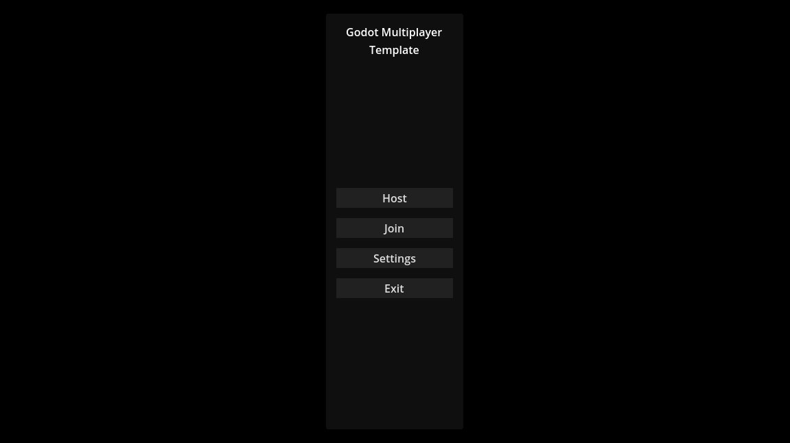
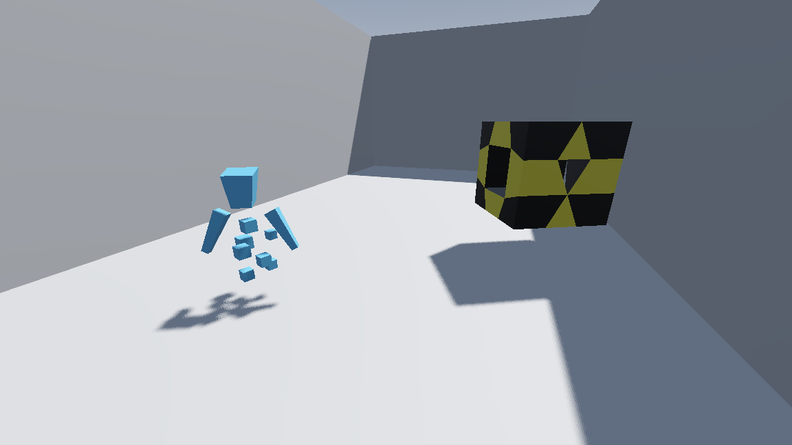

# 📘 Назва проєкту

Багатокористувацький ігровий продукт з підтримкою передбачення на стороні клієнта.

---

## 👤 Автор

- **ПІБ**: Микуш Роман
- **Група**: ФЕІ-42
- **Керівник**: Стахіра Роман, доцент
- **Дата виконання**: [01.06.2025]

---

## 📌 Загальна інформація

- **Тип проєкту**: Ігровий продукт
- **Мова програмування**: C# (.NET)
- **Фреймворки / Бібліотеки**: Godot, CompareNETObjects, GodotInputMapExtension, MemoryPack

---

## 🧠 Опис функціоналу

- 🗒️ Готовий шаблон для розробки багатокористувацьких ігор
- 🖥️ Хостинг сервера в один клік
- 🌐 Підключення до сервера за IP
- 📱 Зручний інтерфейс з широким функціоналом для побудови складніших

---

## 🧱 Опис основних класів / файлів

| Файл     | Призначення |
|----------------|-------------|
| `shared/app_start_up.tscn`      | Точка входу застосунку |
| `client/autoloads/app_manager/AppManager.cs`      | Менеджер застосунку |
| `client/autoloads/job_host/JobHost.cs`      | Менеджер асинхронних робіт |
| `client/autoloads/logger/Logger.cs`      | Менеджер логування |
| `client/autoloads/notification_box/NotificationBox.cs`      | Менеджер сповіщень |

### Файли клієнтської частини застосунку

| Файл     | Призначення |
|----------------|-------------|
| `client/autoloads/auth_service/AuthService.cs`      | Менеджер авторизації на сервері |
| `client/autoloads/game_world/GameWorld.cs`    | Менеджер ігрового світу |
| `client/autoloads/graphic_environment/graphic_environment.tscn` | Графічне середовище |
| `client/autoloads/network/Network.cs` | Менеджер мережевих повідомлень |
| `client/autoloads/player_controller/PlayerController.cs` | Менеджер команд користувача |
| `client/autoloads/scene_factory/SceneFactory.cs` | Менеджер створення нової сцени |
| `client/autoloads/scene_transitioner/SceneTransitioner.cs` | Менеджер зміни поточної сцени |
| `client/autoloads/tick_clock/TickClock.cs` | Менеджер клієнтського годинника і його синхронізації |
| `client/autoloads/transition_ui/TransitionUi.cs` | Менеджер інтерфейсу переходу між сценами |

### Файли серверної частини застосунку

| Файл     | Призначення |
|----------------|-------------|
| `server/autoloads/auth_service/AuthService.cs`      | Менеджер авторизації клієнтів |
| `server/autoloads/game_world/GameWorld.cs`      | Менеджер ігрового світу |
| `server/autoloads/host_checker/HostChecker.cs`      | Менеджер провірки статусу власника |
| `server/autoloads/network/Network.cs`      | Менеджер мережевих повідомлень |
| `server/autoloads/tick_clock/TickClock.cs`      | Менеджер серверного годинника |

---

## ▶️ Як запустити проєкт "з нуля"

Задля запуску проєкту необхідно провести компіляцію [модифікованого коду ігрового рушія Godot](https://github.com/RomanMykush/godot). Інструкція охоплює випадок компіляції вихідного коду на Ubuntu.

### 1. Встановлення інструментів і залежностей

```bash
sudo apt-get update
sudo apt-get install -y build-essential scons pkg-config libx11-dev libxcursor-dev libxinerama-dev libgl1-mesa-dev libglu1-mesa-dev libasound2-dev libpulse-dev libudev-dev libxi-dev libxrandr-dev libwayland-dev dotnet8
```

У випадку якщо буде здійснюватися компіляція під Windows як цільову платформу то також потрібно встановити наступні залежності:

```bash
apt install mingw-w64
```

Після встановлення MinGW, вам потрібно вказати його у змінній оточення MINGW_PREFIX, додавши цей рядок до файлу `~/.bashrc`:

```
export MINGW_PREFIX="/usr/bin/mingw"
```

### 2. Клонування репозиторіїв

Клонування репозиторію проєкту:

```bash
git clone https://github.com/RomanMykush/GodotMultiplayerTemplate.git
```

Клонування репозиторію модифікованого ігрового рушія Godot:

```bash
git clone https://github.com/RomanMykush/godot.git
```

### 3. Компіляція ігрового рушія

```bash
cd godot
```

Вам потрібно здійснити компіляцію виконавчого файлу редактора проєктів ігрового рушія і допоміжного NuGet пакету під цільову операційну систему:

#### Під Windows:

```bash
scons platform=windows target=editor module_mono_enabled=yes
bin/godot.windows.editor.x86_64.mono --headless --generate-mono-glue modules/mono/glue
./modules/mono/build_scripts/build_assemblies.py --godot-output-dir=./bin —godot-platform=windows
```

#### Під Linux:

```bash
scons platform=linuxbsd target=editor module_mono_enabled=yes
bin/godot.linuxbsd.editor.x86_64.mono --headless --generate-mono-glue modules/mono/glue
./modules/mono/build_scripts/build_assemblies.py --godot-output-dir=./bin --godot-platform=linuxbsd
```

Після успішної компіляції, скопіюйте `bin` теку на машину на якій буде запускатися проєкт і встановіть згенерований NuGet пакет:

#### On Windows:

```cmd
dotnet nuget add source "%CD%\bin\GodotSharp\Tools\nupkgs" --name "Godot Packages v4.4.1-custom1"
```

#### On Linux:

```bash
dotnet nuget add source "$(pwd)/bin/GodotSharp/Tools/nupkgs" --name "Godot Packages v4.4.1-custom1"
```

### 4. Запуск

Ви можете здійснити запуск використовуючи редактор проєктів вбудований в скомпільований виконавчий файл.

Альтернативно ви можете запустити проєкт через консоль. Для цього вам потрібно зробити виконавчий файл глобально доступним:

```bash
cd /usr/bin
ln -s -f <full path to file> godot
```

Перейдіть в кореневу директорію репозиторію проєкту і виконайте наступну команду:

```bash
godot
```

### 5. Запуск тестів

Перейдіть в кореневу директорію репозиторію проєкту і виконайте наступну команду:

```bash
godot ++ --tests
```

---

## 🖱️ Інструкція для користувача

1. **Головна сторінка** — вітання і кнопки:
   - `Host` — запустити локальний сервер і під'єднатися до нього як власник
   - `Join` — під'єднатися до запущеного сервера
   - `Settings` — меню налаштувань (в поточному часі пусте)
   - `Exit` — завершити роботу застосунку

2. **Після підключення**:
   - Кнопка `W` — рух вперед
   - Кнопка `A` — рух вліво
   - Кнопка `S` — рух назад
   - Кнопка `D` — рух вправо
   - Кнопка `Space` — стрибок

---

## 📷 Приклади / скриншоти

- Головне меню


- Приклад ігрового світу


---

## 🧪 Проблеми й рішення

| Проблема              | Рішення                            |
|----------------------|------------------------------------|
| Не виходить під'єднатися до сервера | Переконайтесь в можливості прямого з'єднання до сервера |

---

## 🧾 Використані джерела / література

- Офіційна документація Godot
- StackOverflow
